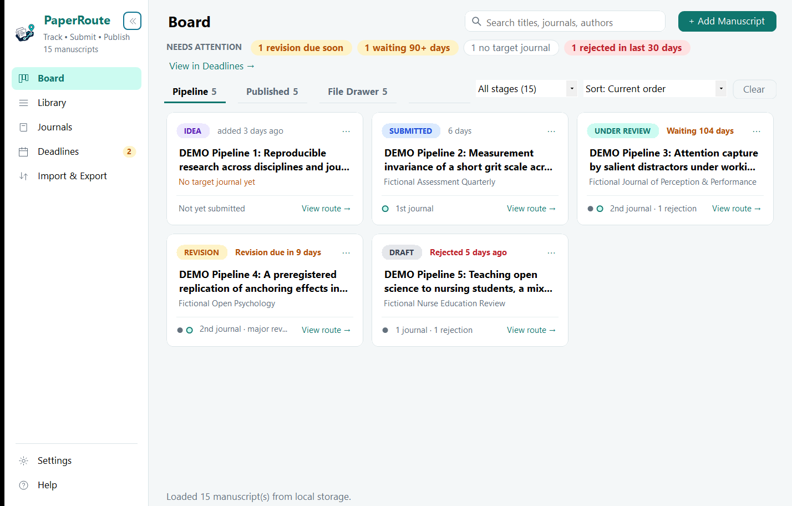
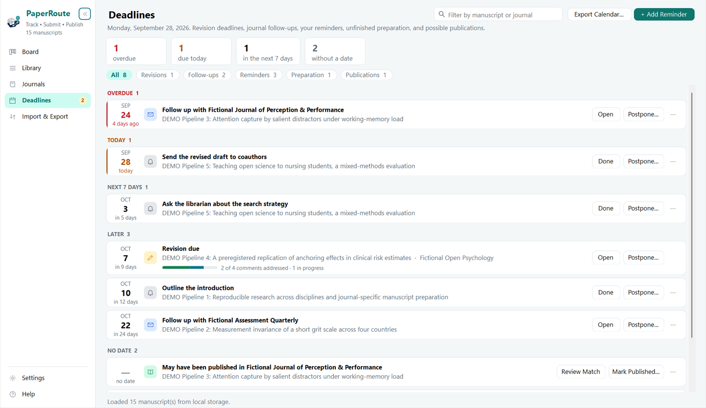
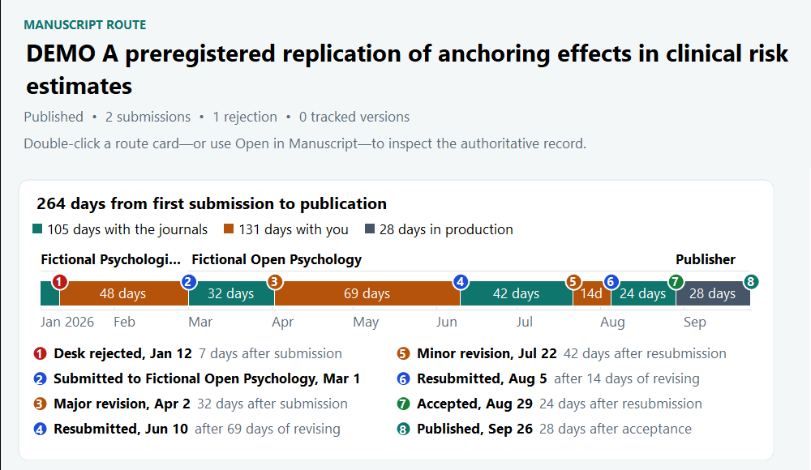

<p align="center">
  
</p>

# PaperRoute

[](https://github.com/JUhalt/PaperRoute-Tracker/actions/workflows/build.yml)
[](https://github.com/JUhalt/PaperRoute-Tracker/releases/latest)
[](LICENSE.txt)

**Local-first, privacy-focused app for tracking academic manuscripts from draft through submission, revision, and publication.**

> **Track • Submit • Publish**

PaperRoute Tracker helps researchers manage manuscripts from idea through submission, peer review, revision, publication—or the File Drawer—without requiring an account or sending the core workflow database to a cloud service.

## Current status

- **Stable:** [v0.8.0 — Route Analytics & Reports](https://github.com/JUhalt/PaperRoute-Tracker/releases/tag/v0.8.0) draws each **route map** to scale, colored by who held the manuscript and when, and adds an **Insights** page with your own journal history and turnaround, shareable **reports**, and **work types and tags**. See the [release notes](docs/releases/0.8.0.md) and the [user guide](docs/USER_GUIDE.md).
- **In development:** [v0.9 — Journal Choice & Guidance](https://github.com/JUhalt/PaperRoute-Tracker/milestone/13), not released yet: a journal shortlist for each manuscript, an offline guide to choosing a journal, journal facts and metrics from open indexes, journals that publish work like yours, your own citations, a teaching example library, and optional AI help, all under one local-first rule with a **Work offline** switch. These are merged to master; certification and release come next.

v0.8 moves the library to Schema 8, which v0.7 cannot open, so keep a backup made with v0.7 before upgrading. The [upgrade notes](UPGRADE_NOTES.md) explain the save and compatibility boundaries.

**New to PaperRoute?** Start with the [PaperRoute User Guide](https://github.com/JUhalt/PaperRoute-Tracker/blob/v0.8.0/docs/USER_GUIDE.md) for a Quick Start, feature tour, and task-oriented "How do I...?" reference.

<p align="center">
  
</p>

## What PaperRoute does

### Track the whole route

- **Pipeline, Published, and File Drawer shelves** for the complete manuscript lifecycle. A filed manuscript can return to the active Pipeline.
- **Needs Attention** for overdue revisions, long reviews, missing target journals, and recent rejections.
- **Search, stage filtering, and sorting** across the manuscript library.
- **Visual Route View** showing submissions, decisions, revisions, and reroutes in order.
- **Version History** with immutable managed snapshots, linked files, or metadata-only versions associated with submissions, decisions, and revision rounds.
- **Work types and colored tags** to sort articles from preprints, posters, and chapters, and to group work your own way.

<p align="center">
  
</p>

### Learn from your routes

- **Route maps** draw a manuscript's whole route to scale, colored by who held it (the journal, you, or production), with every decision and resubmission numbered and explained. They show a student, or a researcher looking back, how much of publishing is waiting and how much is work.
- **Insights** from your own records: median time to a first decision and to acceptance, your history with each journal, and every published route side by side from day 0. Missing dates are left out, never estimated.
- **Pipeline and Route reports** to share with a supervisor or coauthor, as one web page to print or save as PDF, without notes, reviewer comments, or file paths.

<p align="center">
  
</p>

### Prepare and submit

- **Journal submission history** with manuscript numbers, dates, notes, and publisher portal links.
- **Reusable Journal Library** with favorites and shortlists, homepages, submission portals, and checklist templates.
- **Per-journal readiness checklists** applied to a manuscript and tracked as unresolved, complete, or not applicable. Readiness is advisory and never records a submission by itself.
- **Submission Packet Vault** that preserves the exact files prepared for a journal as managed copies, external links, or metadata-only records, with optional local SHA-256 checks that report unchanged, changed, or missing files.

### Revise and respond

- **Editorial decisions** including desk rejection, revision requests, acceptance, and revision deadlines.
- **Reviewer Response Matrix** for reviewer and editor comments, statuses, draft responses, manuscript locations, and an editable response-to-reviewers export.
- **Correspondence and local-file tracking** for decision letters, reviewer comments, response letters, and revised manuscripts.
- **Deadlines** for everything that needs action, grouped Overdue, Today, Next 7 days, Later, and No date: revision deadlines with reviewer-comment progress, journal follow-ups, your reminders, and unfinished submission preparation. **Postpone** changes the date where it lives. Optional Windows notifications and portable `.ics` calendar export.

### Describe and publish

- **DOI & Crossref enrichment** with a preview; only selected fields are applied, and Crossref never changes stage, shelf, or target journal.
- **Publication check**, only when you ask: has a tracked manuscript appeared, by its DOI, its preprint's published version, its title, or your ORCID works? **Mark Published** records it after showing exactly what will change; **Fill Blanks** completes empty publication fields and never replaces a value.
- **ORCID public-profile import** of names, affiliations, and works, with explicit control over whether dated works go to Published.
- **Reusable authors and affiliations** with manuscript-specific order, corresponding-author designation, and optional ORCID iDs.
- **BibTeX and RIS** import with review-before-import and duplicate detection, plus export of selected records.
- **Publication & CV exports** to plain text, Markdown, and HTML.
- **Preprint and project links** for OSF-style resources and other destinations, without storing publisher credentials.

### Keep your data yours

- **Local-first storage** and a managed local document library; no PaperRoute account.
- **Portable ZIP backup and restore** with validation, a preview, and an emergency pre-restore backup.
- **Excel import/export**, legacy tracker import, and a column-mapping wizard for arbitrary spreadsheets.
- **Light, Dark, and Follow Windows themes** and a built-in offline **User Guide**.

The [User Guide](docs/USER_GUIDE.md) explains each workflow in detail.

## Privacy and local-first design

PaperRoute is designed so that its core manuscript-tracking workflow works offline. No PaperRoute account is required.

Crossref and ORCID lookups are read-only and user initiated, and their results are previewed before anything is applied. PaperRoute stores no ORCID password, OAuth token, or client secret, and no publisher credentials.

Current installed/portable PaperRoute application data is stored under `%LocalAppData%\PaperRoute\`.

Visual Studio debugger launches use an isolated development profile under `%LocalAppData%\PaperRoute-Dev\`, with managed copies in `Documents\PaperRoute Dev Library\`. This prevents experimental schema or UI work from modifying the stable library.

The manuscript database, automatic backup, settings, and storage-schema metadata are stored in the active profile. Managed document copies are stored in the corresponding PaperRoute managed library.

When legacy ManuscriptPipeline storage is migrated, PaperRoute retains the legacy source data where possible for rollback and recovery rather than silently deleting it.

## Installing PaperRoute

### Recommended: GitHub Release installer

On the GitHub **Releases** page, download and run the PaperRoute Setup executable from the latest stable release. Installed builds can then check GitHub Releases for future PaperRoute updates.

Fresh installations default to the **Stable** update channel. Users who intentionally want prerelease builds can choose **Preview** under **Settings → Preferences... → Update channel**. Use **Settings → Check for Updates...** to check immediately.

### Portable CI build

The repository's **Build PaperRoute Tracker** workflow still produces a self-contained `PaperRouteTracker-win-x64` artifact for smoke testing. Portable/developer builds intentionally do not perform in-place automatic updates; install PaperRoute using the Setup program to test the updater.

## Importing existing work

Choose **Import & Export → Import Spreadsheet...**.

PaperRoute uses three import paths automatically:

### 1. Standard PaperRoute workbook

Use **Import & Export → Get Import Template...** to generate the supported multi-sheet workbook. It contains:

- `Manuscripts`
- `Submissions`
- `Decisions`
- `Correspondence`

This workbook exchanges the supported manuscript, submission, decision, and correspondence fields. It does not preserve the full library, including Version History, readiness profiles, or submission packets. Use **Backup Library...** for a complete portable library backup.

### 2. Legacy tracker

PaperRoute recognizes the original development tracker when it contains the expected legacy columns such as `TITLE`, `JOURNAL`, `SUBMITTED`, `RESPONSE`, and `STATUS`.

### 3. Map your spreadsheet

If PaperRoute does not recognize either known format, it opens a column-mapping wizard. You can map headings such as:

```text
Paper Name       → Title
Authors          → Co-authors
Outlet           → Submission journal
Date Sent        → Submitted date
Current Status   → Current stage
Outcome          → Editorial decision
Decision Date    → Decision date
Comments         → Notes
```

Only **Title** is required. PaperRoute auto-suggests mappings from common academic spreadsheet headings and shows sample values before import.

## Backup and restore

Choose **Settings → Backup Library...** (also on the Import & Export page) to create a portable ZIP containing:

```text
backup-info.txt
manuscripts.json
authors.json        (when reusable metadata exists)
citations.json      (v0.9 and later, when citation figures are saved)
library.xlsx
files\
```

The native JSON preserves manuscript history, readiness profiles, packet associations, and saved file fingerprints. Reusable authors, affiliations, journals, and journal checklist templates are included when present. From v0.9 (in development), saved citation figures are included too. Managed document copies, including version and packet snapshots, are included; externally linked files remain references to their original paths. The included Excel workbook is a convenient partial export, not a replacement for the ZIP backup.

**Restore Backup...** validates the archive, previews record/file counts, asks for explicit confirmation, creates an emergency backup of the current library, and then restores the selected archive. From v0.9, restoring an archive with saved citation figures replaces yours.

## File Drawer

PaperRoute treats **Published** and **File Drawer** as terminal shelves, while still allowing a filed manuscript to be restored to the active Pipeline. The configurable File Drawer suggestion threshold is intended as a prompt, not an automatic decision.

## Building from source

Requirements:

- Windows 11 recommended
- .NET 10 SDK
- Visual Studio 2026 or another environment capable of building VB.NET WinForms projects

Clone the repository and build:

```powershell
git clone https://github.com/JUhalt/PaperRoute-Tracker.git
cd PaperRoute-Tracker
dotnet restore ManuscriptPipeline.slnx
dotnet build ManuscriptPipeline.slnx --configuration Release
```

The internal project/folder name remains `ManuscriptPipeline` for compatibility and to avoid unnecessary namespace churn. The built assembly is `PaperRouteTracker.exe`.

## Technology

- Visual Basic .NET
- .NET 10 Windows Forms
- ClosedXML for Excel workbook support
- The Anthropic .NET SDK for the optional AI assistant's Claude requests
- System.Text.Json for local persistence
- GitHub Actions for Windows CI and release builds
- Velopack for Windows installation and automatic updates

## Independence

PaperRoute is an independent, open-source project. Its implementation, local-first data model, import/export system, backup workflow, and interface are developed for PaperRoute, and it is not affiliated with any commercial manuscript-tracking service.

## Roadmap

| | Release | Focus |
| --- | --- | --- |
| **Released** | v0.5 — Reviewer Response Workflow | Response matrix, drafting, and Markdown export |
| **Released** | v0.6 — Workspace | One window, manuscript pages, one save step, calmer design |
| **Released** | v0.7 — Deadline Center | Everything that needs action, and when; the publication check |
| **Released** | v0.8 — Route Analytics & Reports | Route maps, your own turnaround data, reports, types and tags |
| **Now** | [v0.9 — Journal Choice & Guidance](https://github.com/JUhalt/PaperRoute-Tracker/milestone/13) | Choosing a journal, journal facts, a teaching example, optional AI help |
| | [v0.9.1 — 1.0 Hardening](https://github.com/JUhalt/PaperRoute-Tracker/milestone/11) | Onboarding, accessibility, recovery, certification |
| **Goal** | [v1.0 — Trusted Research Workflow](https://github.com/JUhalt/PaperRoute-Tracker/milestone/12) | "I trust this application with my research workflow." |

See [`ROADMAP.md`](ROADMAP.md) for the reasoning behind each release. GitHub milestones and issues are the live source of truth for active release work.

## Contributing

Bug reports, usability feedback, importer edge cases, and pull requests are welcome. See [`CONTRIBUTING.md`](CONTRIBUTING.md).

## License

PaperRoute Tracker is licensed under the **GNU General Public License, version 3 only** (SPDX: `GPL-3.0-only`). See [`LICENSE.txt`](LICENSE.txt) for the complete license and [`NOTICE.md`](NOTICE.md) for the project-specific notice.
